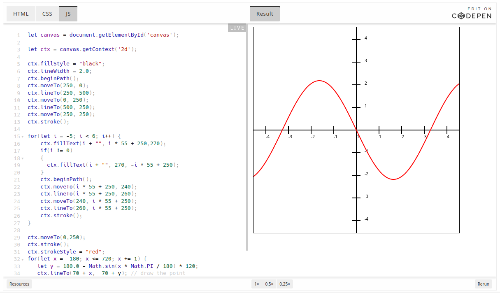
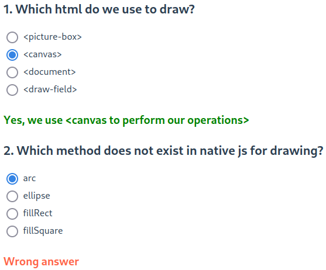
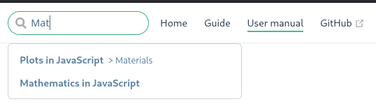

# User manual

## Quick start guide

The application was created for teaching JavaScript programming. Information is presented as articles with editable examples powered by CodePen (changes are saved only until the page is reloaded).

At the moment, articles have been published on the following topics:

- plotting
- table creation
- math operations

Each article is followed by a simple quiz to rate viewer's knowledge

## Navigation

There is a top bar where you can use the search feature, navigate to Home page, view this manual or check out the source code

Or you can use sidebar menu to navigate through guides & articles

## FAQ

Q: Does this website features dark theme?  
A: Unfortunately, no :(

Q: Is this an open-source project?  
A: Yes, it is! You can find the source code [here](https://github.com/pacifi5t/fp-js/tree/dev/learn-js)

Q: will there be any updates to the website or new content?  
A: Maybe, but most likely, not. If the developers will have an urge to create yet another JavaScript learning app, the website certaintly will get big updates.
